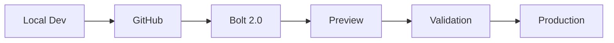

# 🚀 Guide de Déploiement Bolt 2.0 - FossesNotes QUANTUM

## 📋 **Préparation pour Bolt 2.0**

### **✅ Checklist Pré-Déploiement**

- [x] **Git Repository** initialisé
- [x] **README GitHub** optimisé
- [x] **Package.json** avec métadonnées
- [x] **Tests** configurés (Jest + Playwright)
- [x] **Environnement** configuré
- [x] **Base de données** initialisée

### **🔄 Workflow Hybride Recommandé**



## 🎯 **Étapes de Déploiement**

### **1. Créer Repository GitHub**

```bash
# Créer un nouveau repository sur GitHub
# Nom suggéré : fossesnotes-quantum

# Connecter le repository local
git remote add origin https://github.com/VOTRE-USERNAME/fossesnotes-quantum.git

# Push initial
git push -u origin master
```

### **2. Configuration Bolt 2.0**

#### **Repository URL**
```
https://github.com/VOTRE-USERNAME/fossesnotes-quantum
```

#### **Build Settings**
```bash
# Build Command
npm install && npm run build

# Start Command
npm start

# Port
5000
```

#### **Environment Variables**
```bash
NODE_ENV=production
DATABASE_URL=sqlite:///fossesnotes.sqlite
JWT_SECRET=your-production-secret
PAYPAL_CLIENT_ID=your-paypal-client-id
PAYPAL_CLIENT_SECRET=your-paypal-secret
FRONTEND_URL=https://votre-app.bolt.new
```

### **3. Optimisations Bolt 2.0**

#### **Dockerfile Optimisé**
```dockerfile
# Utiliser le Dockerfile existant dans server/
FROM node:18-alpine

WORKDIR /app
COPY package*.json ./
RUN npm ci --only=production

COPY . .
RUN npm run build

EXPOSE 5000
CMD ["npm", "start"]
```

#### **Package.json Scripts**
```json
{
  "scripts": {
    "build": "cd client && npm run build",
    "start": "node server/index.js",
    "postinstall": "npm run setup:production"
  }
}
```

## 🔧 **Configuration Spécifique Bolt 2.0**

### **Variables d'Environnement Recommandées**

```bash
# Base de données (SQLite pour Bolt 2.0)
DATABASE_URL=sqlite:///fossesnotes.sqlite

# JWT
JWT_SECRET=bolt-production-secret-2025

# PayPal (Sandbox pour test)
PAYPAL_CLIENT_ID=sandbox-client-id
PAYPAL_CLIENT_SECRET=sandbox-secret

# Frontend URL
FRONTEND_URL=https://fossesnotes-quantum.bolt.new

# CORS
CORS_ORIGIN=https://fossesnotes-quantum.bolt.new

# Logging
LOG_LEVEL=info
```

### **Optimisations Performance**

#### **1. Base de Données**
```javascript
// Utiliser SQLite en mémoire pour Bolt 2.0
const dbPath = process.env.NODE_ENV === 'production' 
  ? ':memory:' 
  : path.join(__dirname, '../../fossesnotes.sqlite');
```

#### **2. Cache Redis (Optionnel)**
```bash
# Si Redis disponible sur Bolt 2.0
REDIS_URL=redis://localhost:6379
```

#### **3. Compression**
```javascript
// Ajouter compression middleware
const compression = require('compression');
app.use(compression());
```

## 📊 **Monitoring et Analytics**

### **Health Check Endpoint**
```javascript
// Déjà implémenté dans server/index.js
GET /api/health
```

### **Métriques Bolt 2.0**
- **Uptime** : Monitoring automatique
- **Response Time** : < 200ms target
- **Memory Usage** : < 512MB
- **CPU Usage** : < 80%

## 🚀 **Déploiement Automatisé**

### **GitHub Actions (Optionnel)**
```yaml
# .github/workflows/deploy-bolt.yml
name: Deploy to Bolt 2.0
on:
  push:
    branches: [master]
jobs:
  deploy:
    runs-on: ubuntu-latest
    steps:
      - uses: actions/checkout@v2
      - name: Deploy to Bolt 2.0
        run: |
          # Déploiement automatique
          echo "Deploying to Bolt 2.0..."
```

## 🔄 **Workflow de Développement**

### **Développement Local**
```bash
# 1. Développement local
npm run dev

# 2. Tests
npm test
npm run test:e2e

# 3. Commit et push
git add .
git commit -m "feat: nouvelle fonctionnalité"
git push origin master
```

### **Déploiement Bolt 2.0**
```bash
# 1. Bolt 2.0 détecte automatiquement le push
# 2. Build automatique
# 3. Déploiement automatique
# 4. Preview disponible
```

## 📱 **URLs de Preview**

### **Environnements**
- **Développement** : http://localhost:3000
- **Bolt 2.0 Preview** : https://fossesnotes-quantum.bolt.new
- **Production** : https://fossesnotes.com (future)

### **Endpoints API**
- **Health** : https://fossesnotes-quantum.bolt.new/api/health
- **Rivières** : https://fossesnotes-quantum.bolt.new/api/rivieres
- **Auth** : https://fossesnotes-quantum.bolt.new/api/auth

## 🎯 **Prochaines Étapes**

### **Phase 1 : Déploiement Initial**
1. ✅ Repository GitHub créé
2. 🔄 Configuration Bolt 2.0
3. 🔄 Tests de déploiement
4. 🔄 Validation fonctionnalités

### **Phase 2 : Optimisations**
1. 🔄 Performance tuning
2. 🔄 Monitoring avancé
3. 🔄 CI/CD automatisé
4. 🔄 Tests de charge

### **Phase 3 : Production**
1. 🔄 Domain personnalisé
2. 🔄 SSL/HTTPS
3. 🔄 CDN pour assets
4. 🔄 Backup automatique

## 🆘 **Dépannage Bolt 2.0**

### **Problèmes Courants**

#### **Build Failures**
```bash
# Vérifier les logs Bolt 2.0
# Problèmes courants :
- Node.js version incompatible
- Dépendances manquantes
- Scripts de build incorrects
```

#### **Runtime Errors**
```bash
# Vérifier les variables d'environnement
# Problèmes courants :
- JWT_SECRET manquant
- DATABASE_URL incorrect
- CORS mal configuré
```

#### **Performance Issues**
```bash
# Optimisations :
- Réduire la taille des assets
- Optimiser les requêtes DB
- Implémenter le cache
```

## 📞 **Support**

- **Bolt 2.0 Docs** : https://docs.bolt.new
- **GitHub Issues** : https://github.com/username/fossesnotes-quantum/issues
- **Logs Bolt 2.0** : Dashboard Bolt 2.0

---

**🎣 Prêt pour le déploiement Bolt 2.0 !**
